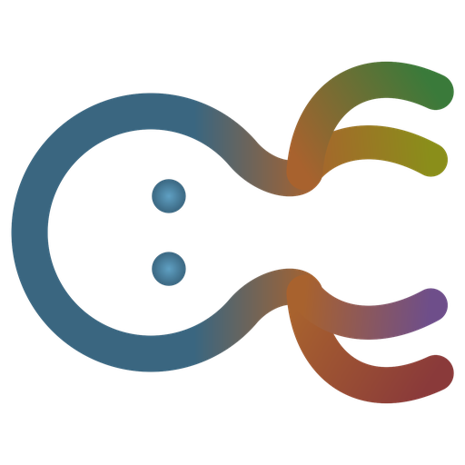
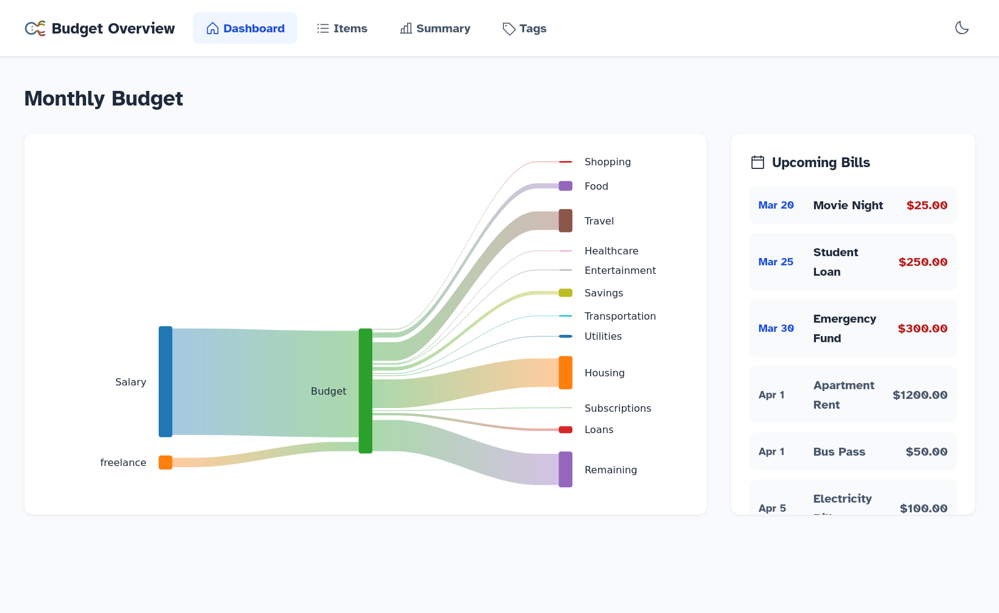
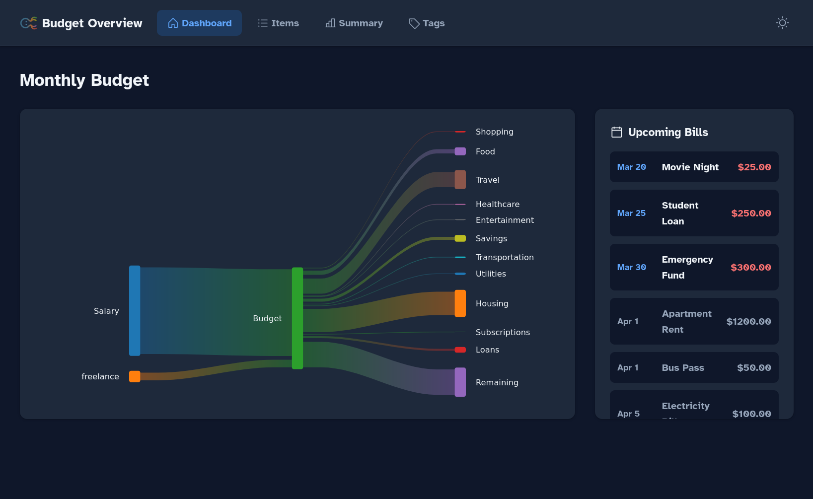

<div align="center" width="100%">
  
</div>

# Budget Overview

I made this to replace my family's Excel spreadsheet. It's a simple monthly budget planner with a clear visual overview of money in and money out, and what's left (or in deficit) afterwards.

## Screenshot

| Light mode | Dark mode |
| --- | --- |
|  |  |

## Features

- **Sankey diagram** — visualise your full budget as a flow from income through expenses to remaining or deficit, updates live as items are added
- **Recurring items** — enter income and expenses at any frequency, everything normalises to monthly automatically
- **Variable amounts** — month-by-month overrides for things that change, like utilities
- **Tags and reports** — tag items and filter the summary view, handy for things like home office expenses at tax time
- **Upcoming bills** — sidebar showing what's due this month in date order
- **Dark mode** — full light and dark theme
- **PWA** — installable on desktop and mobile, works offline

## What it's not

It's not a transaction tracker or accounting software. No bank sync, no receipt scanning, no daily logging. It's for setting up your monthly budget picture and understanding it visually.

## Tech Stack

- **Frontend** — React, TypeScript, Vite
- **Backend** — Rust, Axum
- **Database** — SQLite
- **Visualisation** — @nivo/sankey
- **Icons** — Phosphor React
- **Font** — Atkinson Hyperlegible

## Quick Start

Create a `docker-compose.yml`:
```yaml
services:
  app:
    container_name: budget-overview-app
    image: ghcr.io/mgrimace/budget-overview-app:latest
    ports:
      - "3001:3001"
    volumes:
      - ./data:/app/data
    environment:
      DATABASE_PATH: /app/data/budget.db
    restart: unless-stopped
```

Then run:
```bash
docker compose up -d
```

Open `http://localhost:3001`. Data persists to `./data/budget.db`.

## API Endpoints

| Method | Path | Description |
| ------ | ---- | ----------- |
| GET | /api/budget-items | List all budget items |
| POST | /api/budget-items | Create a budget item |
| GET | /api/budget-items/:id | Get a budget item |
| PUT | /api/budget-items/:id | Update a budget item |
| DELETE | /api/budget-items/:id | Delete a budget item |
| GET | /api/tags | List all tags |
| POST | /api/tags | Create a tag |
| PUT | /api/tags/:id | Rename a tag |
| DELETE | /api/tags/:id | Delete a tag |
| GET | /api/cashflow | Get Sankey diagram data |
| GET | /api/upcoming-bills | Get upcoming bills |

## Normalization

All amounts are normalized to monthly values for display and calculation.

| Frequency | Formula |
| --------- | ------- |
| Daily | amount × 30 |
| Weekly | amount × 4.33 |
| Biweekly | amount × 2.17 |
| Monthly | amount |
| Yearly | amount ÷ 12 |

Variable bills (e.g. utilities with different amounts each month) are averaged across the months provided.

## Default Tags

Housing, Utilities, Food, Transportation, Healthcare, Entertainment, Shopping, Travel, Subscriptions, Loans

Untagged expense items appear under **Misc** automatically.

## Support

If you've found this project helpful and would like to support further development, please consider donating. Thank you:

[](https://www.paypal.com/cgi-bin/webscr?cmd=_donations&business=R4QX73RWYB3ZA)
[](https://liberapay.com/cammarata.m/)
[](https://www.ko-fi.com/mgrimace)
[](https://www.buymeacoffee.com/cammaratam)